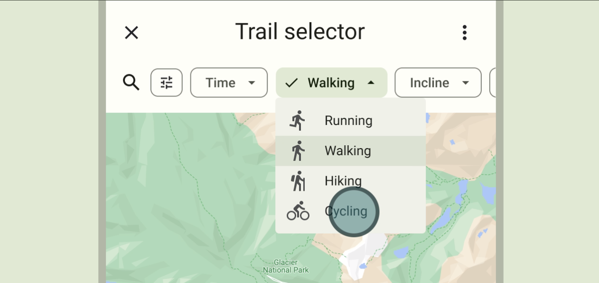
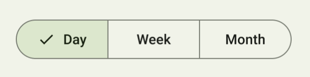
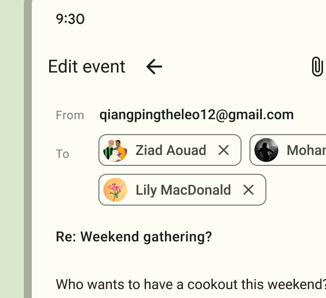
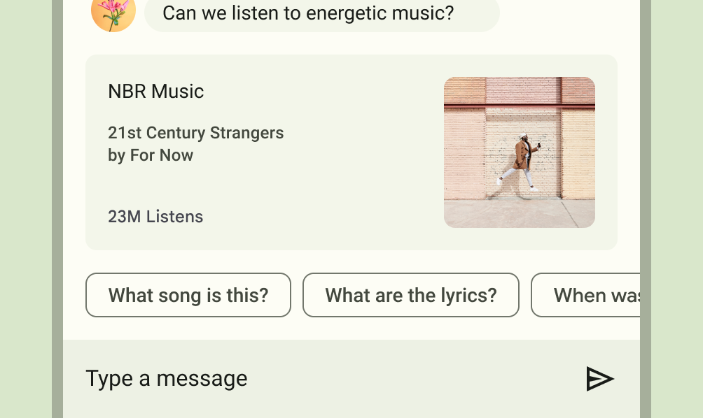
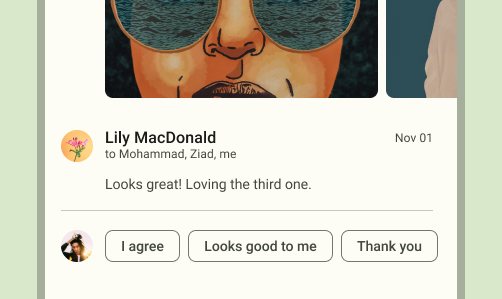
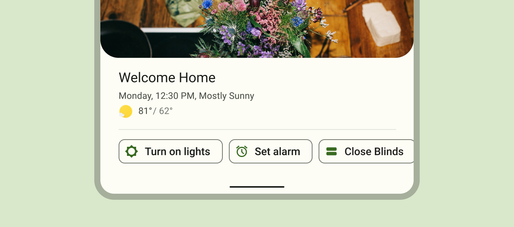

# Chips and buttons

* Buttons
    * Press
    * Switch
    * Segmented switch
    * Coin
    * Icon
* Chips
    * Input
    * Filter
    * Assist
    * Suggestion

| Element | Guidance | Styling | Size |
|-|-|-|-|
| Buttons | Persistent and consistent | No outline, or gray outline, or full tone fill. Toned text. Upper case. Raised on focus. | Large |
| Chips | Dynamic and contextual | Gray outline or half tone fill. Gray text. Mixed case. Colour change on focus. | Small |

Table: Differences between chips and buttons

# Types of buttons and chips

* Action
    * Suggestion chip
    * Assist chip
    * Button
* ???
    * Badges
* Switches
    * Switches
    * Segmented switches
    * Menu switches

| Element | M2 | M3 | Notes |
|-|-|-|-|
| Badge | Input chip | Input chip |  |
| Switches | Filter chip | Filter chip |  |
| Segmented switches | Choice chip | Filter chip |  |
| Menu switches |  | Filter chip |  |
| Suggestion chip | Action chip | Suggestion chip |  |
| Assist chip | Action chip | Assist chip |  |

Table: Names for each element

# Styling

| Element | Style | Notes |
|-|-|-|
| Badge |  |  |
| Switches | Rounded corners, half tone fill on selection |  |
| Segmented switches | Rounded corners, half tone fill on selection |  |
| Menu switches | Rounded corners, half tone fill on selectio, down arrow |  |
| Suggestion chip | Rounded corners, no fill, small |  |
| Assist chip | Rounded corners, no fill, small |  |

# Switches

These elements are used to toggle binary states.
For example, selecting filtering and search parameters.
Sometimes they are used in forms.

|  | Number of options | Switch | Form |
|-|-|-|-|
| Single select | 2-4 | Segmented switch | Segmented switch |
| Single select | 3+ | Menu switch | Menu field |
| Multi select | 1-7 | Switch | Switch |
| Multi select | 7+ | Form | Input field with badges |

## Switches

These are also known as filter chips in M3.

<!-- Interaction -->
The switch is clickable and this toggles the chip between a selected and unselected state.

<!-- Options -->
Switches should be used for mutually exclusive options.
The state of a filter chip should therefore not affect the state of another filter chip.

<!-- Style -->
When unselected, the switch has an outline but no fill.
When selected, the chip has half tone fill, and has a tick mark on the left.

- [ ] Images of large square switch

## Menu switches

<!-- Interaction -->
The menu switch is clickable and this opens up a list of menu options.

<!-- Options -->
This solution should be used if there are more than three mutually exclusive options.

<!-- Style -->
A menu switch has a downward triangular arrow on the right to indicate it is a menu switch.
When unselected, the chip has an outline but no fill.
When active, the switch has half tone fill, with a tick mark on the left and displaying the selected option. 

- [ ] Images of large square menu switch

## Segmented switches

<!-- Interaction -->
Each option in the segmented switch is clickable and this toggles the switch between the different options.
One option is always selected and it will therefore have a default option.

<!-- Options -->
This solution should be used if there are two to three mutually exclusive options.

<!-- Style -->
The switch has an outline with each option segmented by a dividing line.
When an option is selected it has half tone fill, and has a tick mark on the left.

- [ ] Images of large square segmented switch

# Badges

These are also known as input chips in M3.

<!-- Options -->
Represent selections in a multiple selection input field.

<!-- Interaction -->
When editable, badges must have a clickable cross icon on the right.
Clicking the cross icon removes the badge selection from the input.
The badge itself can be clickable, see M3 specification for input chips.

<!-- Style -->
The badge should have an outline and no fill.
The badge can have an optional icon on the left.

Action
======

| Button | Chip |
|-|-|
| Persistent and consistent | Dynamic and contextual |
| Button | Assist chip, Suggestion chip |

Table: Action chips and buttons

Suggestion chips
----------------

Suggestion chips present dynamically generated suggestions, such as possible quick-reply responses in a chat or starting a search query.

Suggestion chips have no fill and an outline with no icons.
The whole chip is clickable.
The chip displays the generated response or query question.

Assist chips
------------

Assist chips represent smart or automated actions as though the user asked an assistant to complete the action.

Assist chips have no fill and an outline and should have an icon.
The whole chip is clickable.
Assist chips can show progress and confirmation feedback.

Buttons
-------

* Regular
    * Primary / Secondary / Tertiary
    * Text / Square
* Coin
* Icon
