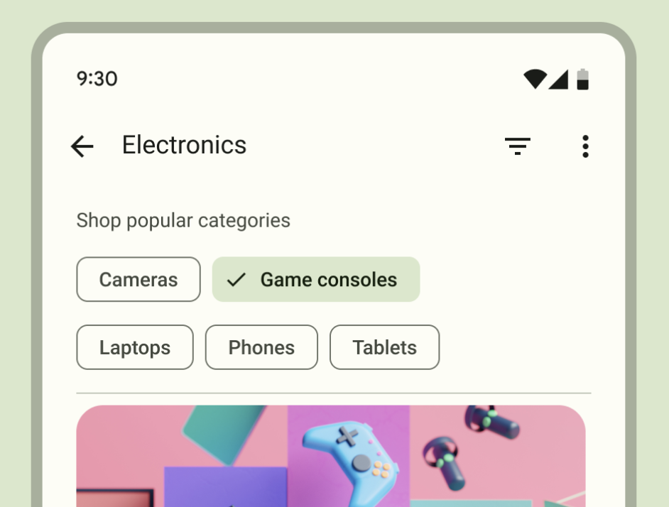
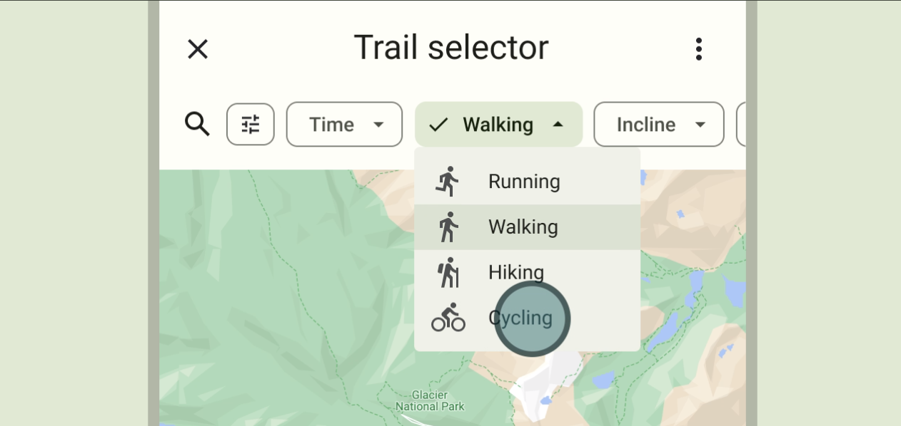
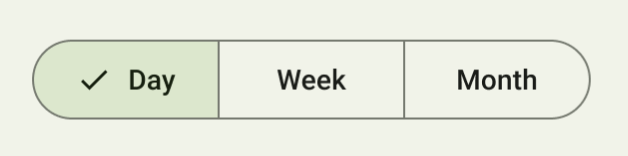

# Overview

The design language should follow the [M3 material design specification](https://m3.material.io/) with the following exceptions.

An alternative is the [M2 material design specification](https://m2.material.io).

# Chips

Use square chips from M3.
Chips either have no fill and an outline or half tone fill and no outline.

| M3 chip | Description |
|-|-|
| input | Indicate selections in a multiple selection field.  | 
| filter | Known as "choice" chips in M2. Used to filter search results. |
| assist | A specialisation of "action" chips from M2. |
| suggestion | A specialisation of "action" chips from M2. |

## Input chips

Input chips must have a clickable cross icon on the right.
Clicking the cross icon removes the chip selection from the input.

The chip should have an outline and no fill.
The chip can have an optional icon on the left.

The chip itself is not clickable.

# Buttons

Use square button specification from M2.

## Differences between chips and buttons

| Element | Guidance | Styling | Size |
|-|-|-|-|
| Chips | Dynamic and contextual | Gray outline or half tone fill. Gray text. Mixed case. Colour change on focus. | Small |
| Buttons | Persistent and consistent | No outline, or gray outline, or full tone fill. Toned text. Upper case. Raised on focus. | Large |

# Filtering

## Filter chips

The filter chip is clickable and this toggles the chip between a selected and unselected state.

When unselected, the chip has an outline but no fill.
When selected, the chip has half tone fill, and has a tick mark on the left.

The state of a filter chip should not affect the state of another filter chip.

## Menu filter chips

A menu filter chip has a downward triangular arrow on the right to indicate it is a menu filter chip.

When unselected, the chip has an outline but no fill.
When active, the chip has half tone fill, with a tick mark on the left and displaying the selected option. 

This solution should be used if there are more than three mutually exclusive options.

## Segmented buttons

Segmented buttons should not be used.

Instead a segmented filter chip should be used.

The solutions should be used if there are three or less mutually exclusive options.

# Action

An alternative to assist and suggestion chips are buttons, which should appear persistently and consistently, while chips should appear dynamically and contextually.

## Suggestion chips

Suggestion chips present dynamically generated suggestions, such as possible quick-reply responses in a chat or starting a search query.

Suggestion chips have no fill and an outline with no icons.
The whole chip is clickable.
The chip displays the generated response or query question.

## Assist chips

Assist chips represent smart or automated actions as though the user asked an assistant to complete the action.

Assist chips have no fill and an outline and should have an icon.
The whole chip is clickable.
Assist chips can show progress and confirmation feedback.

## Buttons

...
